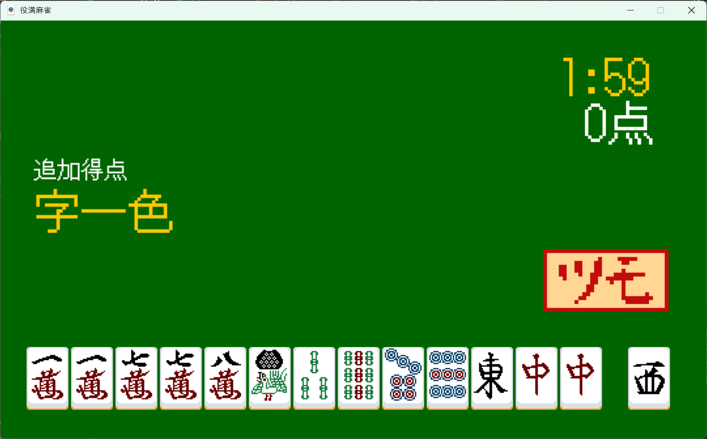
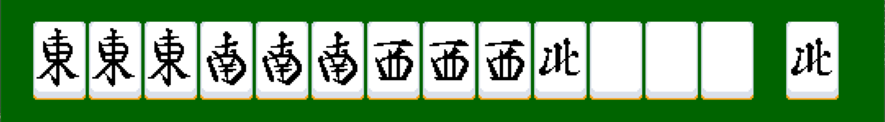
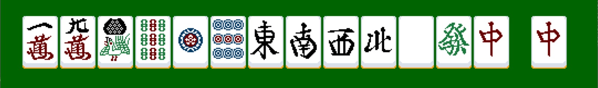

# 役満麻雀
Pygameで麻雀をモチーフにしたパズルゲームを遊ぶことができるプログラムです。
# ルール

基本的な麻雀用語は本来の麻雀のルールを参照してください。 
「開始」のボタンを押すと、ゲームが開始します。開始時には、本来麻雀と同様に、手牌を13枚引いた後、追加で1枚引きます。手牌の中から一枚をクリックすると、その牌は捨て牌に移動し、新しい牌を引きます。そして、手牌で役を作り、「ツモ」のボタンを押してアガリをすることで、制限時間以内により多くの点数を稼ぐことが目標です。 
しかし、通常の麻雀と異なる点がいくつか存在します。

- 山の概念が存在しない

山の概念が存在しないので、牌を何枚でも引くことができます。同じ牌を14枚集めてアガリをすることも可能です。

- 対局相手が存在しない

この麻雀には対局相手が存在しません。また、本来の麻雀にはある鳴き(ポン、チーなど)もできません。

- 役満でしか上がれない

本来の麻雀では手牌に役があればアガリをして点数を獲得できますが、このゲームでは、その中でも役満と呼ばれる強い役でしか上がることができません。上がることのできる役は後述します。

- 捨て牌とツモ牌を入れ替えることができる

鳴きができない代わりに、捨て牌をクリックしたときに、その牌とツモ牌を入れ替えることができます。効率よく牌を集めるために役立てましょう。

# **役**

## **四暗刻**

同じ牌を三つ集めた刻子が四つあると成立します。
## **字一色**

字牌のみでアガリをすると成立します。
## **緑一色**

緑色の牌(索子の二、三、四、六、八、及び字牌の發)のみでアガリをすると成立します。
## **大三元**

三元牌(白、發、中)の刻子をすべて集めると成立します。
## **小四喜**

風牌(東、南、西、北)のうち一つを雀頭として手牌に持ち、残りの風牌の刻子をすべて集めると成り立ちます。
## **大四喜**

風牌の刻子をすべて集めると成立します。
## **清老頭**

風牌の刻子をすべて集めると成立します。
## **九蓮宝燈**

数牌のスートを一種に絞り、一、九を三枚、ほかの数字を一枚ずつ揃え、加えて同じスートの牌をもう一つ持っていると成立します。
## **国士無双**

么九牌(数牌の一、九、及びすべての字牌)を一枚ずつ揃え、加えて么九牌をもう一つ持っていると成立します。
## **万象統一**

同じ牌を14枚集めると成立します。後述する追加得点には選ばれません。 
※天和、ローカル役満はありません
※アガリをすると、役満の倍数の分制限時間が伸びます

また、画面左部分の「追加得点」に表示されている役でアガリをすることで、追加で役の倍数が一つ増加します。

# 制作者のコメント

少し前に制作したRPGと違い、Pygameを使って本格的にゲームを作ってみました。このゲームのアイデアは、とある麻雀のレトロゲームから来ています。そのゲームでは、デバッグモードの名残か、隠しコマンドを入力すると自由に手牌を交換することができるもので、同じ牌を5枚以上揃えてすごく強い役で上がることができるというものです。では、最初からそれを前提として麻雀を作れば面白いと考え、これを制作しました。根も葉もないことを言いますが、麻雀ではない別のゲームとして遊ぶべきです。 
ここだけの話、万象統一に関しては、同じ牌を集めるのが面倒なので、インパクト以外は長所がありません。

## 制作期間
2025年12月～2025年1月

# License
Copyright 2020 The DotGothic16 Project Authors (https://github.com/fontworks-fonts/DotGothic16)
This Font Software is licensed under the SIL Open Font License, Version 1.1 . This license is copied below, and is also available with a FAQ at: https://openfontlicense.org

SIL OPEN FONT LICENSE Version 1.1 - 26 February 2007
